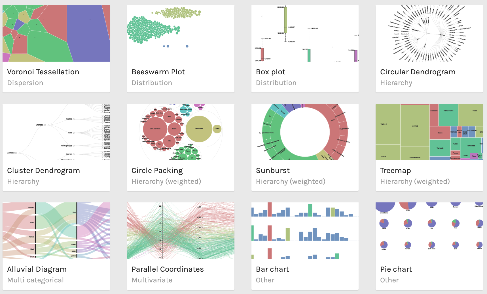

# RAWGraphs

RAWGraphs is an open web tool to create custom vector-based visualizations 
on top of d3.js library by Mike Bostock. 
It has been developed by DensityDesign Research Lab (Politecnico di Milano) and Calibro, 
and sustained through a corporate stewardship by ContactLab.

## Screenshot Sample
<p align="center">



## GitHub Project Page

https://github.com/densitydesign/raw

## How-To 

```
## view/edit Dockerfile

## build image
docker build -t raw_graphs .

## run container
docker container run --name raw_graphs --detach --publish 5000:5000 raw_graphs:latest

```

```
## access container
curl http://127.0.0.1:5000

```

```
## teardown container
docker container rm -f $(docker container ls -aq -f name=raw_graphs) 

## teardown image
docker image rm -f $(docker image ls -aq -f reference='raw_graphs*') 

```

## Live Demo

https://app.rawgraphs.io

